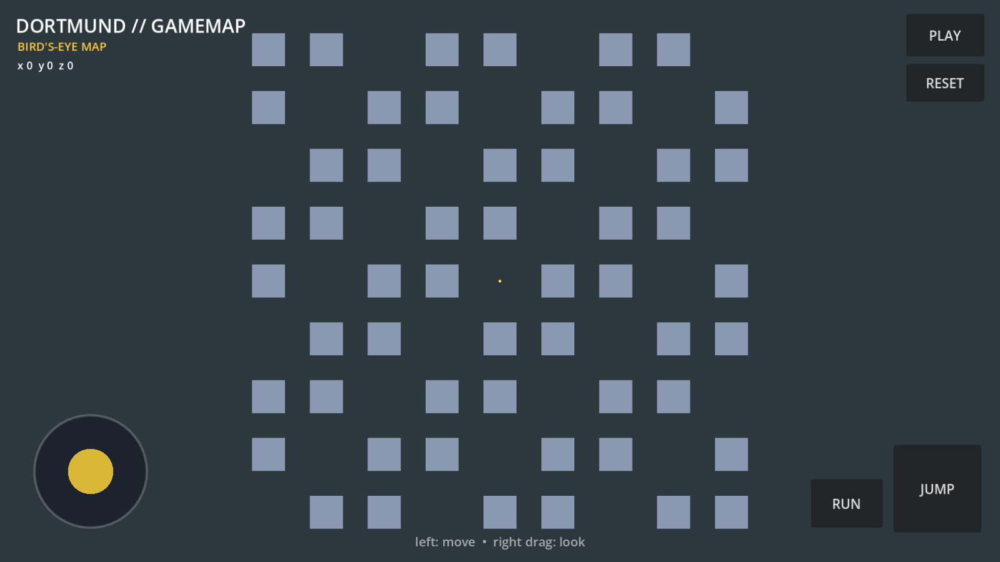

# DortmundGameMap

## Current visual



Automated CI capture of the configured main scene. When connected-world render bundles are unavailable, the runtime now falls back to the visible placeholder city instead of presenting an empty authoritative streaming state. Provenance: [`docs/status/current.json`](docs/status/current.json).


Godot 4.7.1 project for a georeferenced, walkable Dortmund world.

## Current milestone

The current runtime proves that the existing Dortmund model can be loaded locally in Godot and exported to Android. The next architecture step is to replace the monolithic city asset with reproducible geodata chunks while preserving real-world coordinates.

## Repository principles

- Keep canonical geocoordinates in EPSG:25832.
- Render locally around a floating origin.
- Keep terrain collision separate from visual LoD2 meshes.
- Stream 256 m world cells rather than one giant model.
- Preserve source/license metadata for every generated asset.
- Do not commit raw large geodata or build outputs to Git.

## Docs

- `docs/SOURCES.md` — authoritative and open data sources.
- `docs/PIPELINE.md` — geodata → Godot build pipeline.
- `data/source_registry.json` — machine-readable source registry.

## Validate source registry

```bash
python3 scripts/check_sources.py
```

## Current local asset

The working Android build uses the existing full-geometry Dortmund model as a runtime asset. That binary is intentionally excluded from Git.
